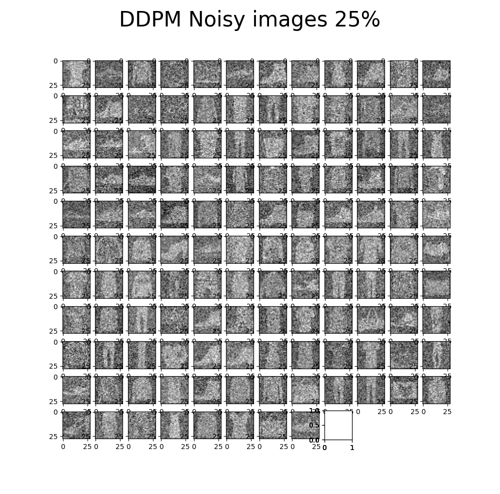

# Fashion-DDPM-from-scratch
This is an unofficial implementation of the DDPM paper (https://arxiv.org/abs/2006.11239) on the standard Fashion-MNIST dataset.

## 
Implementation of Denoising Diffusion Probabilistic Model in Pytorch. It is a new approach to generative modeling that may have the potential to rival GANs. It uses denoising score matching to estimate the gradient of the data distribution.

### Training 
Running the `main.py` script starts the download and training on Fashion MNIST dataset.

### Results (20 Epochs)

For time purposes and computational limitations the model was only trained for 20 epochs.

 
 

 
 
 

